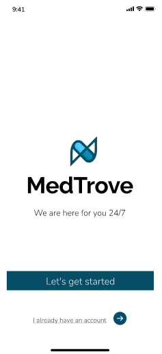
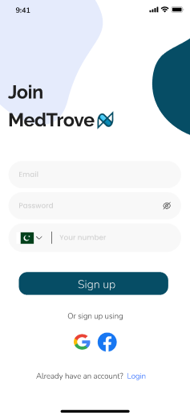
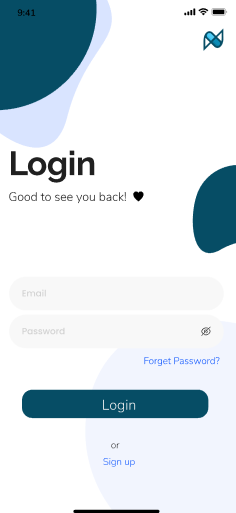

# 🏥 MedTrove - Find Affordable Medication Alternatives  

## 📌 Overview  
MedTrove is a cross-platform mobile application that helps users find alternative medicines with similar ingredients but at lower prices. The app provides features such as drug-to-drug interaction checking, medicine search, pharmacy locator, and profile management.  

---

## 🎬 App Walkthrough  
# 📌 MedTrove – A Smart Medicine Assistance App  

## 🌟 Overview  
MedTrove is a cross-platform app designed to help users find alternative medicines, check drug interactions, locate pharmacies, and manage their profiles and cart.  

---

## 📱 **App Screens & Features**  

### 1️⃣ **Splash Screen**  
The first screen users see when they launch the app.  
  


### 2️⃣ **Login & Signup**  
Users can register or log in to access app features.  
- **Signup:** Creates a new user account.


---

- **Login:** Authenticates existing users.
  

### 3️⃣ **Home Page**  
The main dashboard displaying featured medicines, quick search, and navigation to other features.  
  

### 4️⃣ **Search Medicine**  
Users can search for a medicine and view its alternatives.  
  

### 5️⃣ **Alternative Medicine List**  
Displays alternative medicines for a searched drug along with pricing and availability.  
  

### 6️⃣ **Medicine Info Page**  
Detailed information about a specific medicine, including uses, dosage, side effects, and prices.  
  

### 7️⃣ **Cart**  
Users can add medicines to their cart and proceed to checkout.  
  

### 8️⃣ **Payment Page**  
Allows users to complete their purchases securely using various payment options.  
  

### 9️⃣ **Profile Management**  
Users can update their profile details, manage orders, and save preferences.  
  

### 🔟 **Drug-to-Drug Interaction Checker**  
Allows users to check potential interactions between different medicines.  
  

### 1️⃣1️⃣ **MediBot (Chatbot Assistant)**  
A chatbot to assist users with medicine-related queries.  
  

### 1️⃣2️⃣ **Pharmacy Locator**  
Displays nearby pharmacies where users can purchase medicines.  
  

### 1️⃣3️⃣ **Donation Page**  
Users can donate medicines or contribute to help others access affordable healthcare.  
  

---

## 🏗️ **Tech Stack**  

### 🖥️ **Frontend**  
- React Native  
- JavaScript  

### 🌐 **Backend**  
- Node.js  
- Express.js  

### 🗄️ **Database**  
- MongoDB (Mongoose)  

### 🔐 **Authentication**  
- JWT (JSON Web Token)  

---

## ⚙️ **Setup & Installation**  

### 1️⃣ Clone the Repository  
```sh
git clone https://github.com/your-username/medtrove.git
cd medtrove
```

### 2️⃣ Install Dependencies
```sh
npm install
```

### 3️⃣ Start the Backend Server
```sh
cd backend
node server.js
```

### 4️⃣ Start the Frontend (React Native)
```sh
cd frontend
npx expo start
```

# 📌 Project Architecture (MVC)  

MedTrove follows the **Model-View-Controller (MVC)** architecture:  

---

## 🏗️ Backend Structure (Node.js, Express, MongoDB)  

### 📂 controllers/  
Handles logic and processes API requests.  

- `AlternativeController.js` – Handles alternative medicine queries.  
- `CurrentUserController.js` – Manages user sessions.  
- `DDIController.js` – Processes drug-to-drug interaction queries.  
- `MedicineController.js` – Handles medicine search requests.  
- `PriceController.js` – Retrieves pricing details.  
- `authController.js` – Manages authentication (login/signup).  
- `cartController.js` – Handles cart-related operations.  

### 📂 models/  
Defines the database schema (**MongoDB via Mongoose**).  

- `Alternative.js` – Stores alternative medicines.  
- `IndiaPrice.js` – Stores medicine pricing in India.  
- `Medicine.js` – Medicine details.  
- `PakPrice.js` – Stores medicine pricing in Pakistan.  
- `cart.js` – User cart model.  
- `currentUser.js` – Stores user session data.  
- `ddi.js` – Stores drug-to-drug interaction data.  
- `user.js` – Stores user details.  

### 📂 routes/  
Defines API endpoints for frontend interaction.  

- `DDIRoutes.js`  
- `alternativeRoutes.js`  
- `authRoutes.js`  
- `cartRoutes.js`  
- `currentUserRoutes.js`  
- `medicineRoutes.js`  
- `priceRoutes.js`  

### 📜 Additional Backend Files  

- `package.json` – Manages dependencies.  
- `server.js` – Main server file.  
- `server_mvc.js` – MVC-based server setup.  

---

## 📱 Frontend Structure (React Native)  

### 📂 screens/  

- `APITest.js` – Tests API endpoints.  
- `App.js` – Main application file.  
- `Cart.js` – Manages cart functionality.  
- `DDI.js` – Drug-to-drug interaction checker.  
- `RecommendationAlgo.py` – Recommends alternative medicines.  
- `login.js` – User authentication.  
- `medinfo.js` – Medicine information page.  
- `pharmacy.js` – Pharmacy locator.  
- `productList.js` – Displays available medicines.  
- `profilemangement.js` – User profile settings.  
- `search.js` – Search functionality.  
- `signup.js` – Registration screen.  
- `splash.js` – Splash screen.  

### 📜 Additional Frontend Files  

- `app.json` – App configuration.  
- `babel.config.js` – Babel settings.  
- `config.js` – API configurations.  
- `eas.json` – Expo app settings.  
- `index.js` – Entry point.  
- `metro.config.js` – Metro bundler settings.  
- `package-lock.json`, `package.json` – Dependencies.  

---

## 📌 Contributors  

👤 **Kissa Zahra** – [LinkedIn Profile](https://www.linkedin.com/in/kissa-zahra/)  
👤 **Aliza Ibrahim** – [LinkedIn Profile](https://www.linkedin.com/in/aliza-ibrahim/)  
👤 **Hamna Sadia Rizwan** – [LinkedIn Profile](https://www.linkedin.com/in/hamna-rizwan/)  

